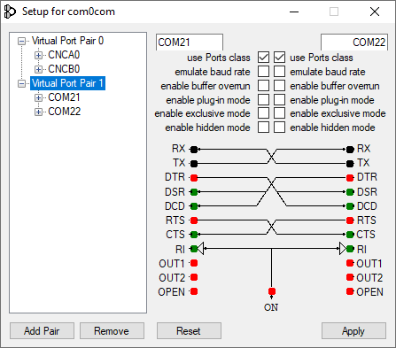
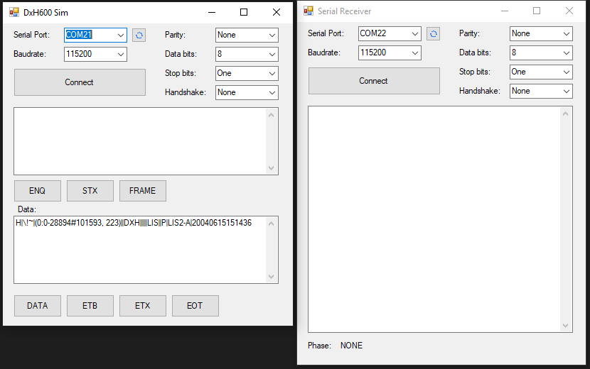

# Serial Receiver with Data Parser
- if you have DxH600 device, please choose correct COM port
- Run `DxH600.exe`, set the COM port and settings, press CONNECT

- if you dont have that device, install COM2COM and make a pair of Virtual COM ports 
- In `DxH600 Sim` windows, to simulate a message, press in the below steps:
`ENQ` > `STX` > `FRAME` > enter your data > `DATA` > `ETB` or `ETX` > `EOT` 

