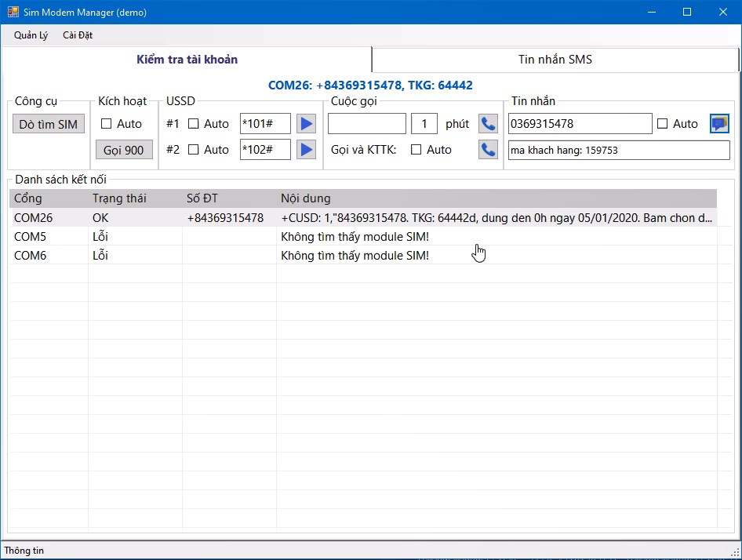

# [GMS Modem Manager](https://github.com/vuquangtrong/PoC/tree/master/GmsModemManager)
This project aims to provide a full solution for a GMS modem

## Sim and Account

1. Auto scan and check SIM port
2. Auto/Manual activate new SIM card
3. Auto/Manual check balance, do topup via USSD code
4. Auto/Manual call to a number and end call
5. Auto/Manual send SMS message to a group of numbers, with defined or formated content
6. Have a list to monitor status of all SIM ports on the modem

## SMS

1. Auto/Manual read/send/delete SMS from SIMs
2. Auto scan SMS message to get pre-defined content such as activation code, name

## GPRS

1. Connect to a web server
2. Forward SMS/ status to mobile/webserver

## Export

1. Simple database to store SIM history (balance, topup, sms, calls)
2. Export to Excel file

# Video demo: [SimModemManager_demo.mp4](./SimModemManager_demo.mp4)

