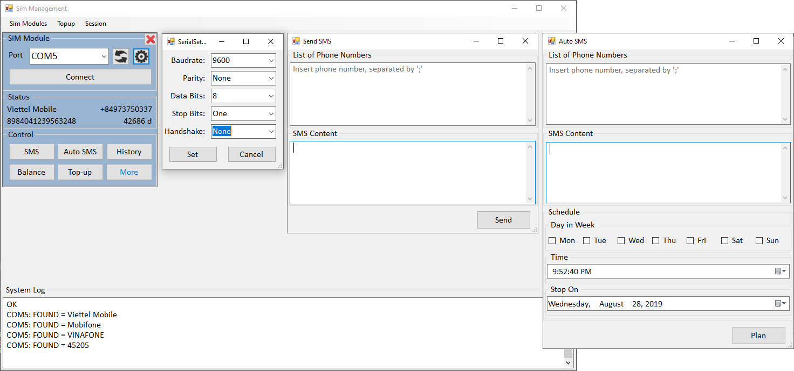
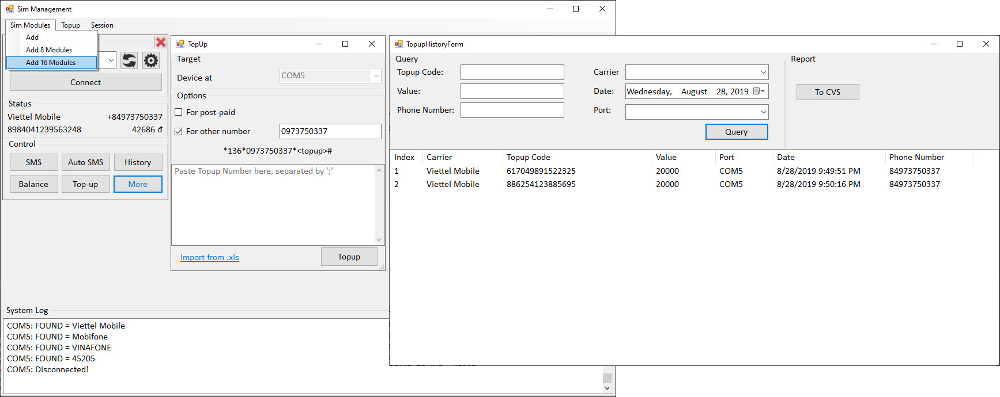

# [SIM Gateway Manager](https://github.com/vuquangtrong/PoC/tree/master/SimManager)
This project aims to provide a manager for GSM Gateway:
* Support Multiple devices via COM port
* Compatiable with AT-command sets
* Support SMS/ AutoSMS/ Balance/ Topup
* Save activities in logs
* Automactically check and report SIM status
* Support import/ export from Excel CVS, TXT

# Video demo: [SimManager.mp4](./SimManager.mp4)

