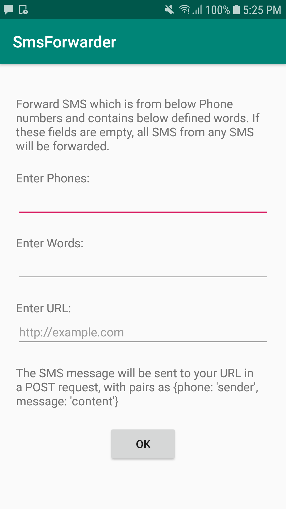

# [SMS Forwarder](https://github.com/vuquangtrong/PoC/tree/master/SmsForwarder)
This project aims to provide a method to filter and forward important SMS
* Set a list of phone numbers to check SMS content
* Set a list of words in SMS content
* Setup formward mode: SMS forward, Web Push
* Automatically run at startup, silent run
* Saved settings
* Remote update settings via SMS (you dont need to open app, send an SMS with keyword to update settings remotely)

# Video demo: [SmsForwarder.mp4](./SmsForwarder.mp4)

