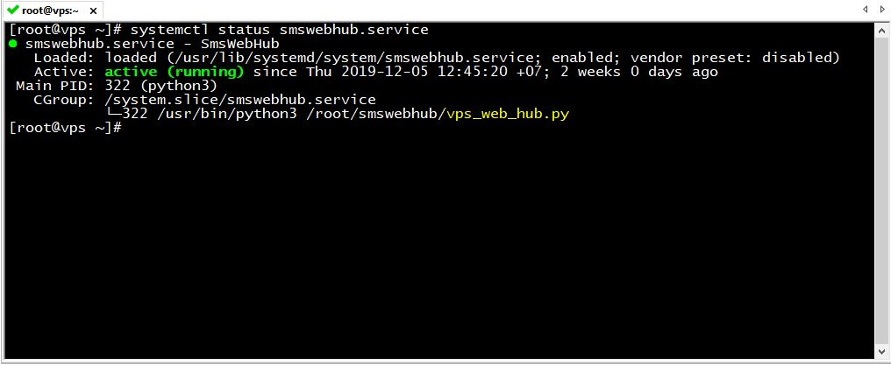

# [SmsWebHub](https://github.com/vuquangtrong/PoC/tree/master/SmsWebHub)
This project aims to provide a simplified SMS hub to replace GSM modem  
Project contains Web Server to get request from user from internet, then forwards requests to a hub mobile devices which will do SMS/ CALL/ USSD commands and reports back to users.

## Commands
Optinal param to select which SIM will be used to send SMS: _from=sim1|sim2_  
Only if _from=sim2_, SIM slot 2 will be used. Otherwise, SIM slot 1 or default SIM will be used.  
Default SIM might be your SIM slot 2 if the first slot is empty.  

### SMS
Send a SMS message to _number X_, with _content Y_, authorized by your _app token Z_

```
<vps_ip_address>:8000/sms?number=X&content=Y&token=Z[&from=sim1|sim2]
```

### USSD
Query an _USSD code X_ and forward response message to other host, authorized by your app _token Z_  
Command X will be added __*__ and __#__ to make completed USSD code.

For exampleL _cmd=101_, USSD code will be _*101#_

```
<vps_ip_address>:8000/ussd?cmd=X&token=Z[&from=sim1|sim2]
```

### CALL
Make a call to _number X_ and _hangup after Y second_, authorized by your app _token Z_  
If no time is given, _default is 5s_

```
<vps_ip_address>:8000/call?number=X&time=Y&token=Z[&from=sim1|sim2] 
```

To end call, simply use end=y

```
<vps_ip_address>:8000/call?end=y&token=Z
```


