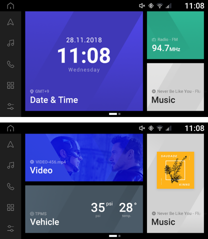
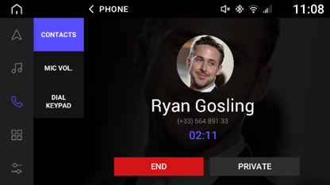
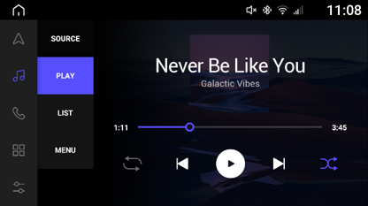

# SquareUX
Design and make a new UI for a headunit on car.
Using QT5 for multi-platform compatible.
Demo can run on Windows, or on Linux target board.
The system support background workers, multi-threads.

Download: 
[demo on windows](./SquareUX_HMI_Preview_2_Windows_20180228.mp4)

[demo on real hardware](./SquareUX_HMI_Preview_2_on_board_20180228.mp4)

